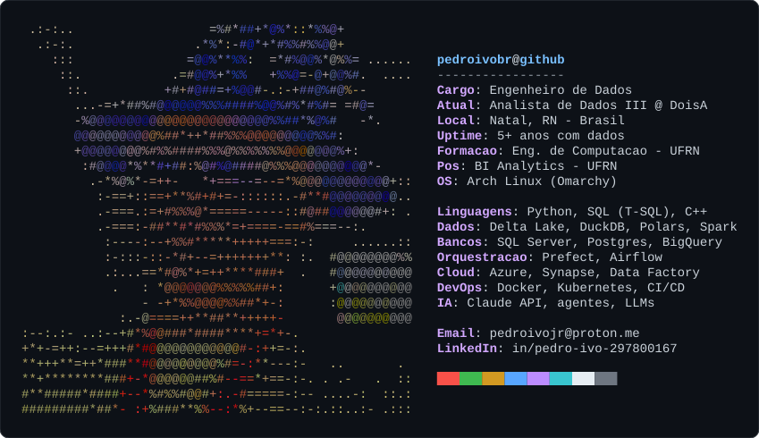

<picture>
  <source media="(prefers-color-scheme: dark)" srcset="./neofetch-dark.svg">
  <source media="(prefers-color-scheme: light)" srcset="./neofetch-light.svg">
  
</picture>

  
  

### Sobre

Engenheiro de Dados com mais de 5 anos construindo e mantendo pipelines ETL/ELT em Azure e
on-premise: Data Warehouse, Delta Lake em camadas Bronze/Silver/Gold, cargas incrementais e
orquestração com Prefect e Airflow. Hoje, na **DoisA Engenharia e Tecnologia**, e em transição para
o perfil de *AI Native Engineer*, levando LLMs e agentes de IA para dentro dos pipelines de dados.

### Trajetória

| Quando | Onde | Papel |
|---|---|---|
| 2022 – hoje | DoisA Engenharia e Tecnologia | Analista de Dados III |
| 2021 – 2022 | Supermercado Nordestão | Analista de Dados e RPA |
| 2020 – 2022 | TRE-RN | Analista de Business Intelligence |

O card acima é gerado por <a href="./gerar.py"><code>gerar.py</code></a> a partir do meu avatar.
